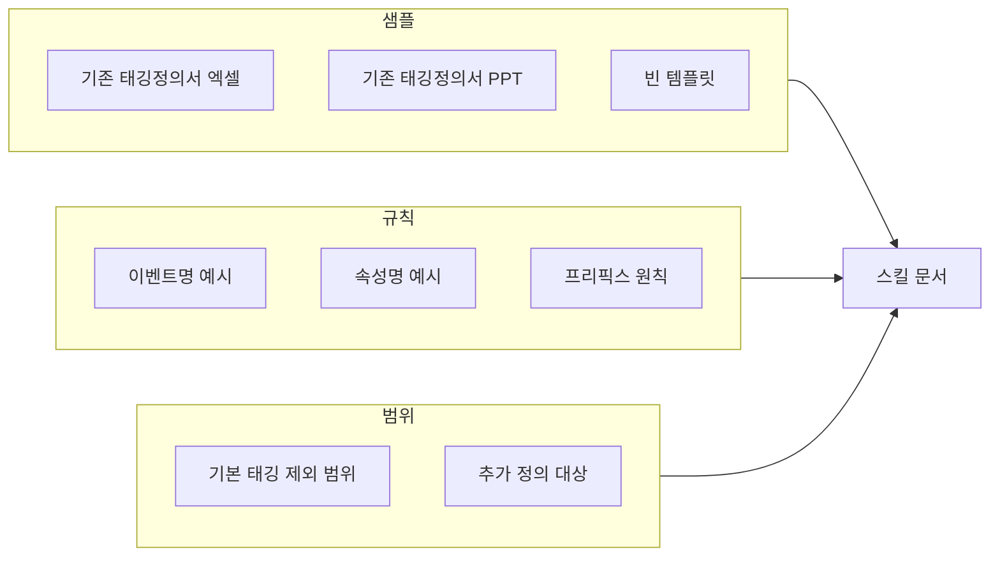

# 태깅정의 스킬 작성 준비물 최종 정리

스킬을 구체화하기 위해 아래 항목을 미리 준비해 두면 좋습니다.

---

## 1. 참고용 샘플 문서

| 항목 | 설명 | 비고 |
|------|------|------|
| **기존 태깅 정의서 (엑셀)** | 실제 개발팀에 전달했던 엑셀 표 양식 1~2건 | 컬럼명·행 구성·용어를 그대로 스킬에 반영할 수 있음 |
| **기존 태깅 정의서 (PPT)** | 동일 내용의 PPT 버전이 있다면 1건 | 슬라이드별 구성·표 형태 참고용 (생성 출력은 엑셀용 표로 할 예정) |
| **빈 템플릿** | 컬럼만 있고 값이 비어 있는 정의서 | 스킬에서 "이 컬럼을 채운다"는 목표를 명시하기 좋음 |

- 여러 화면·여러 이벤트가 포함된 샘플이면 스킬 문구를 더 구체화하기 쉽습니다.

---

## 2. 서비스·도메인 정보

| 항목 | 설명 | 비고 |
|------|------|------|
| **대상 서비스** | www.hanatour.com, m.hanatour.com | 스킬 서두에 맥락으로 명시 |
| **기본 태깅 범위** | 서비스 전역에서 이미 수집 중인 항목(개념만이라도) | "기본 태깅 외에 추가로 정의할 것" 범위를 스킬에 적을 때 필요 |
| **추가로 정의할 대상** | 기능 활용 여부(버튼 클릭), 신규 화면 오픈, 부가 기능(인쇄 등) 활용 여부 | 스킬 가이드의 핵심 정의 대상 |

---

## 3. 네이밍·규칙 정리

| 항목 | 설명 | 비고 |
|------|------|------|
| **기존 이벤트명 예시** | 실제 사용 중인 이벤트명 5~10개 (예: `view_detail_pkg_slpd`, `load_pages`, `main_popup_mkt`) | 프리픽스·패턴 추출용 |
| **기존 속성명 예시** | Event Properties 예시 (예: `areaCd`, `saleProdCd`, `depDay`, `saleProdNm`) | 스킬에서 권장 네이밍·프리픽스 제안 시 참고 |
| **프리픽스 원칙** | "가급적 프리픽스 사용" 구체화 (예: `view_`, `click_`, `load_` 등) | 샘플에서 추린 뒤 스킬에 고정 문구로 넣을지 결정 |

- 샘플에 없으면, 스킬 초안에서는 일반적인 규칙(예: `[액션]_[대상]_[상세]`)만 넣고 이후 샘플로 보강해도 됩니다.

---

## 4. 출력·사용 방식 확정

| 항목 | 설명 | 비고 |
|------|------|------|
| **생성 형식** | 엑셀용 표(마크다운 표)로 생성 → 사용자가 복사해 엑셀에 붙여넣기 | 확정 |
| **PPT가 필요한 경우** | "엑셀 표를 복사한 뒤, 화면/이벤트별로 슬라이드에 붙여넣어 사용" 안내만 스킬에 한두 줄 추가 | 선택 |

---

## 5. 사용자 입력 안내용 문구 (스킬에 넣을 내용)

스킬 문서에 포함할 "사용자가 제공할 것" 안내 초안입니다.

- **필수**: 어떤 화면인지, 어떤 기능/버튼/액션을 추적할지에 대한 **텍스트 설명**
- **권장**: 기획서·화면정의서 중 해당 부분 **텍스트 붙여넣기** 또는 **슬라이드 이미지 첨부**
- **참고**: 기획서/화면정의서가 PPT로 제공돼도 됨. 내용을 채팅에 **텍스트로 붙여넣거나**, **슬라이드를 이미지로 첨부**하면 됨

이 문구는 준비물이 아니라, 준비물을 바탕으로 스킬을 쓸 때 넣을 안내입니다.

---

## 6. 체크리스트 요약

- **최소**: (1) 기존 태깅 정의서 샘플 1건(엑셀 또는 PPT), (2) "어떤 화면/기능을 추가로 찍을지"에 대한 설명(기본 vs 추가)
- **권장**: 위 표의 샘플·규칙·범위를 모두 정리한 뒤 스킬 초안 작성

---

## 7. 스킬 작성 시 참고할 워크스페이스

- Cursor 스킬 생성 가이드: `~/.cursor/skills-cursor/create-skill/SKILL.md` 참고 시, SKILL.md 구조·트리거 문구·도메인 지침을 일관되게 넣을 수 있습니다.
- 스킬을 둘 위치: 전사 공용이면 `~/.cursor/skills/` 또는 팀 공유 폴더, 프로젝트 한정이면 해당 레포의 `.cursor/skills/` 등 저장 위치를 미리 정해 두면 좋습니다.

이 준비물을 바탕으로 스킬 초안을 작성하면, "태깅을 잘 모르는 기획자도 어떤 항목에서 태깅을 정의해야 하는지" 가이드와, 엑셀용 표 초안 생성까지 한 번에 안내하는 스킬을 만들 수 있습니다.
